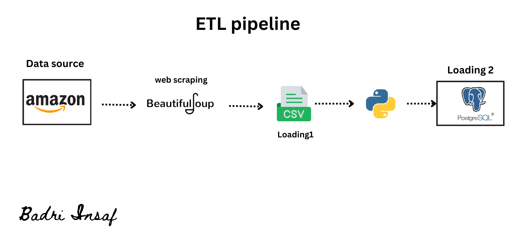

# ETL Project 

## Overview

This ETL (Extract, Transform, Load) pipeline is designed to automate the process of extracting data from Amazon website ,
transforming it into a usable format, and loading it into a  Postgres database. This project is built with Python, leveraging libraries such as `requests`, `BeautifulSoup`, `pandas`, and `psycopg2` (for PostgreSQL). 

## Table of Contents
- [Technologies Used](#technologies-used)
- [Project Details](#project-details)
    - [Part 1: Webscraping](#part-1-webscraping)
    - [Part 2: Transform Data ](#part-2-Transform)
    - [Part 3: PostgreSQL Loding](#part-3-PostgreSQL-Loding)

## Technologies Used
- Python  
- BeautifulSoup4
- Requests
- Pandas
- Numpy
- PostgreSQL (for data storage)
- psycopg2 (PostgreSQL adapter for Python)

## Project Details 
  ### Part 1 : Extract Data (Web Scraping)
  The first step in the pipeline is to extract data , using `Beautifulsoup` and `Requests` to scrap  Amazon website  data { Product's title ,price ,availibility and  rating } and stores it in a CSV file.
  ### Part 2 : Transform Data (Cleaning)
  After extraction, the data may require cleaning or formatting,using `Pandas` and `Numpy`
  ### Part 3 : Load Data into PostgreSQL
  The final step is to load the cleaned data from the CSV file into the PostgreSQL database using `psycopg2`
